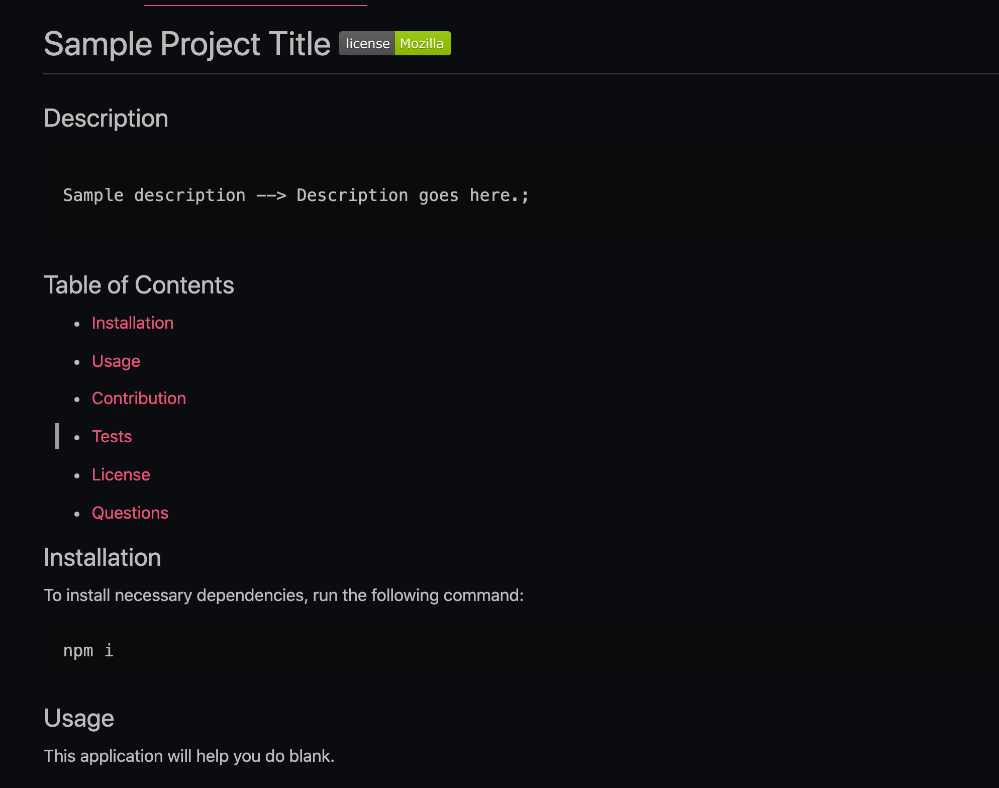

# Professional README Generator 
 
  ## Description
  
  ### User Story
  AS A developer <br>
  I WANT a README generator <br>
  SO THAT I CAN quickly create a professional README for a new project 

  ## Table of Contents

  * [Installation](#installation)

  * [Usage](#usage)

  * [Walkthrough](#walkthrough)

  * [Screenshot](#screenshot)

  * [Contribution](#contribution)

  * [Questions](#questions)

  ## Installation

  To install necessary dependencies, run the following command:

  ```
  npm install
  ```

  ## Usage

  As a web developer, writing a quality README can feel daunting. This application helps developers easily create README files. This command-line application accepts user input about their application and a high-quality, professional README is created. Users are also able to choose licenses for their application and a badge is added to the README file.

  ## Walkthrough

  Click [here](https://drive.google.com/file/d/1DDt8TvrazpOeO4UN0dUWuNRXpQSH9asm/view) to see a walkthrough of the application.

  ## Screenshot 

  
 

  ## Contribution 

  All contributions are welcome. Please visit the [issues](https://github.com/pmac16/README-generator/issues) tab  to contribute.

  ## Questions

  If you have additional questions, please email me at priya.macpherson@gmail.com.

  Connect with me on GitHub! : [pmac16](https://github.com/pmac16)

### ©️Priya Macpherson

